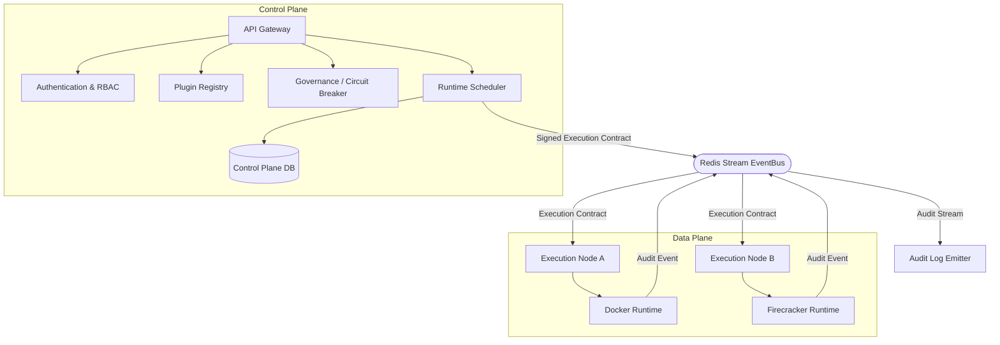
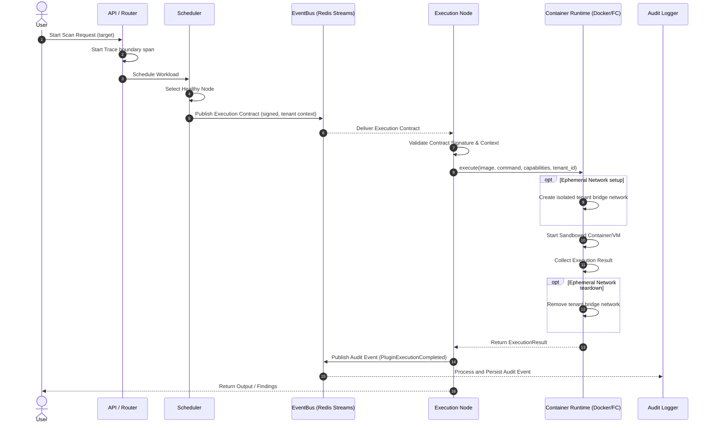
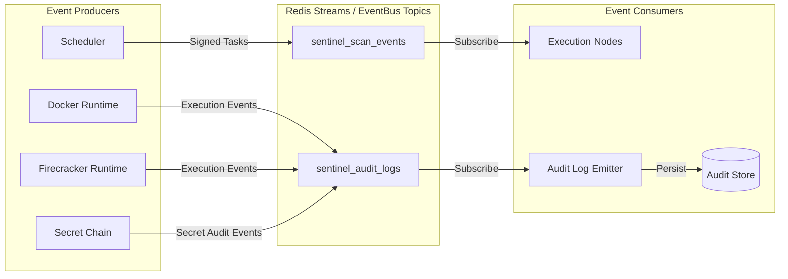
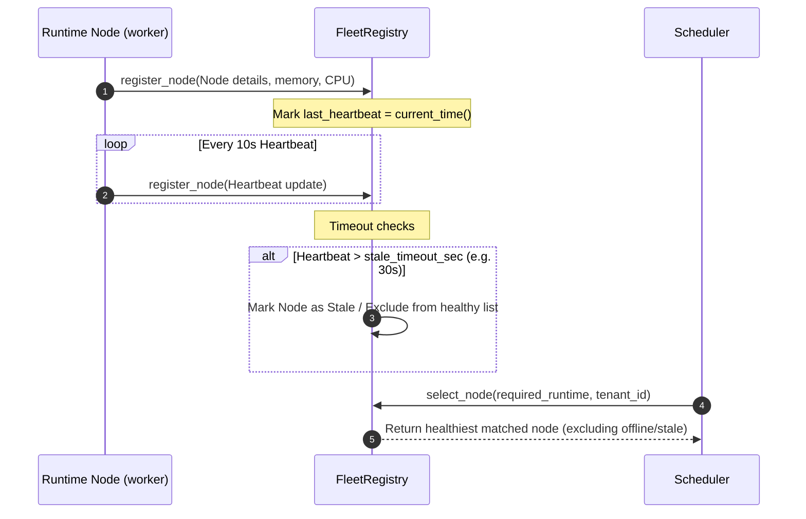

# SENTINEL Scale & Observability Operational Runbook

This runbook details incident response procedures, system architecture flows (in Mermaid format), request tracing, SLO monitoring, fleet management, and AI governance policies for the SENTINEL security orchestration platform.

---

## 1. System Architecture & Flows

### 1.1 Control Plane / Data Plane Separation
The architecture enforces a strict boundary between the Control Plane (stateful, authoritative database access, API, and policy governance) and the Data Plane (stateless sandboxed executors, signature checking, and plugin execution). Data plane nodes do not receive database credentials and communicate solely via event bus contracts.



### 1.2 Runtime Sequence Flow
This sequence shows the path of a request as it traverses API, Scheduler, Execution Node (with ephemeral bridge network setup), and finally to the Audit log bus.



### 1.3 Event Stream Flow (EventBus Topics)
Sentinel relies on Redis Streams to distribute tasks and collect audit logs across nodes.



### 1.4 Fleet Registration & Heartbeat Flow
Nodes check in periodically to declare capacity and health.



---

## 2. Incident Response Procedures

### 2.1 Observability Context
- **Incident: Trace Export Failures**
  - **Symptom:** OpenTelemetry span exporters log `OTLP export failed` or telemetry events are missing from the dashboard.
  - **Triage:** Check if the OTel Collector endpoint is reachable. Verify container network connectivity.
  - **Mitigation:**
    1. If the collector is down, fall back to console logging by updating the TracerProvider configuration.
    2. Restart the OpenTelemetry Collector container/service.

### 2.2 Event Bus Context
- **Incident: Redis Stream Backlog/Stuck Workers**
  - **Symptom:** Subscriptions yield stale events; scheduler/audit pipelines show high processing lag.
  - **Triage:** Check stream consumer group info:
    ```bash
    redis-cli XINFO GROUPS sentinel_audit_logs
    ```
  - **Mitigation:**
    1. If a consumer is dead, delete the consumer from the group to trigger message reallocation.
    2. Add additional reader processes/worker replicas if memory or CPU pressure is observed.

### 2.3 AI Governance Context
- **Incident: False Positive Circuit Breaker Trips**
  - **Symptom:** Requests fail with `Circuit Breaker is open` errors, but downstream LLM calls are healthy.
  - **Triage:** Examine the trip reason in the audit logs to find which policy (TokenPolicy, CostPolicy, LatencyPolicy, etc.) tripped the breaker.
  - **Mitigation:**
    1. Tune the budget thresholds or window size via `AIPolicy` instantiations in `packages/ai_governance/breaker.py`.
    2. Reset the breaker manually:
       ```python
       from packages.ai_governance.breaker import circuit_breaker
       await circuit_breaker.reset(context)
       ```

### 2.4 Execution Context
- **Incident: Ephemeral Tenant Network Leaks**
  - **Symptom:** Host runs out of bridge networks; `docker network create` fails due to subnet exhaustion.
  - **Triage:** Run `docker network ls` and look for dangling `sentinel-net-*` networks.
  - **Mitigation:**
    1. Clean up stale/dangling networks:
       ```bash
       docker network prune -f
       ```
    2. Review the finally blocks in `packages/execution/docker.py` to ensure networks are always deleted on exit.

---

## 3. Disaster Recovery (DR) Procedures

### 3.1 Total EventBus Outage (Redis Failure)
1. **Detection:** Scheduler and Audit emitters throw continuous `ConnectionError` or log `Failed to publish async audit event to EventBus`.
2. **Failover Action & Durability Invariants:**
   - **Fail-Closed Policy:** If the Redis EventBus is unavailable, the control plane scheduler immediately suspends new scan execution contract scheduling. All new execution requests must fail closed rather than running unmonitored or un-audited.
   - **No Silent Event Dropping:** If a running workload attempts to complete or perform sensitive operations (e.g., resolving a secret or granting capability) but cannot connect to the Redis event bus to log the audit event, the execution process will crash or abort the transaction. No security-sensitive action is permitted to occur silently.
   - **Local Logging Fallback:** The warning output logged by emitters is strictly a diagnostic/forensic aid to locate the error. It is **not** a durable event store fallback and does not bypass the fail-closed policy. Under no circumstances should local warnings be treated as a valid substitute for persistent audit trail logging.
3. **Recovery:**
   - Restore the Redis container or broker node:
     ```bash
     docker-compose restart redis
     ```
   - Verify Redis cluster health and connectivity before resuming the scheduler.

### 3.2 Host Node Failure / Network Partition
1. **Detection:** The `FleetRegistry` reports that a node has missed its heartbeat for > 30 seconds and marks it as `stale`.
2. **Failover Action:**
   - The scheduler routes all upcoming execution contracts to remaining healthy nodes.
   - Any execution task currently running on the failed node is reassigned to another node.
3. **Recovery:**
   - SSH into the partitioned node, verify Docker daemon state, and check venv status.
   - Restart the node agent to resume heartbeats:
     ```bash
     python sentinel_bootloader.py
     ```

### 3.3 Ephemeral Network Reclaim Script (Orphan Cleanup Job)
If worker processes exit abnormally, bridge networks may be left orphaned. The following script runs as a daily cron job. It uses a safe reconciliation mechanism, ignores networks utilized by paused/restarting workloads, handles inspect failures gracefully, and logs removals as audit events:

```python
import json
import subprocess
import logging

logging.basicConfig(level=logging.INFO)
logger = logging.getLogger("sentinel.network_reclaim")

def clean_orphaned_networks():
    """
    Reconciles tenant bridge networks and removes orphans.
    Ignores networks used by running, paused, or restarting containers.
    Handles inspection errors gracefully and logs all actions as audit events.
    """
    try:
        # 1. Get all Docker networks named sentinel-net-*
        net_proc = subprocess.run(
            ["docker", "network", "ls", "--filter", "name=sentinel-net-", "--format", "{{.Name}}"],
            capture_output=True, text=True, check=True
        )
        sentinel_nets = [line.strip() for line in net_proc.stdout.splitlines() if line.strip()]
        if not sentinel_nets:
            logger.info("No sentinel networks found. Nothing to clean.")
            return

        # 2. Get all containers (including paused, restarting, exited, etc.)
        container_proc = subprocess.run(
            ["docker", "ps", "-a", "-q"],
            capture_output=True, text=True, check=True
        )
        container_ids = [line.strip() for line in container_proc.stdout.splitlines() if line.strip()]

        active_nets = set()
        for cid in container_ids:
            try:
                # Inspect container to check status and network configuration
                inspect_proc = subprocess.run(
                    ["docker", "inspect", cid],
                    capture_output=True, text=True, check=True
                )
                inspect_data = json.loads(inspect_proc.stdout)
                if not inspect_data:
                    continue
                
                container_state = inspect_data[0].get("State", {})
                status = container_state.get("Status", "").lower()
                
                # Keep networks for running, paused, or restarting workloads
                if status in ("running", "paused", "restarting"):
                    networks = inspect_data[0].get("NetworkSettings", {}).get("Networks", {})
                    for net_name in networks.keys():
                        active_nets.add(net_name)
            except (subprocess.CalledProcessError, json.JSONDecodeError, KeyError, IndexError) as e:
                logger.warning(f"Failed to inspect container {cid} gracefully: {e}. Keeping its networks active to avoid disruption.")
                # Safe fallback: if we can't inspect a container, abort the clean to prevent breaking active nodes
                return

        # 3. Reconcile and clean up orphaned networks
        for net in sentinel_nets:
            if net not in active_nets:
                logger.info(f"[AUDIT] Removing orphaned tenant bridge network: {net}")
                try:
                    subprocess.run(["docker", "network", "rm", net], check=True, capture_output=True)
                    logger.info(f"[AUDIT] Successfully removed orphaned network {net}")
                except subprocess.CalledProcessError as e:
                    logger.error(f"Failed to remove network {net}: {e.stderr.strip()}")
            else:
                logger.debug(f"Network {net} is active; skipping.")
    except Exception as e:
        logger.error(f"Critical error during network reconciliation: {e}")

if __name__ == "__main__":
    clean_orphaned_networks()
```

---

## 4. Trace Debugging & Verification

To trace a scan request end-to-end across SENTINEL's bounded contexts:

### 4.1 Trace Lifecycle Flow
1. **API boundary:** `trace_boundary("api_request")`
2. **Scheduler boundary:** `trace_boundary("schedule_plugin")`
3. **Execution boundary:** `trace_boundary("execute_sandbox")`
   - Sets attributes: `tenant_id`, `execution_id`, `node_id`, `runtime_type`, and `runtime_version`
4. **Audit boundary:** Emitted events carry the trace ID.

### 4.2 Verifying Trace Attributes
Ensure trace data contains the following standard attributes:
```json
{
  "tenant_id": "tenant-abc",
  "execution_id": "uuid-v4-execution-id",
  "node_id": "worker-node-01",
  "runtime_type": "docker",
  "runtime_version": "1.0.0"
}
```

---

## 5. SLO Monitoring & Alerting Thresholds

SENTINEL targets strict SLOs measured by the `SLOMonitor` metric histograms:

| Metric Name | Target | Alerting Threshold | Severity |
|-------------|--------|--------------------|----------|
| `sentinel_api_latency_seconds` | p95 < 500ms | > 1.0s over 5 min | High |
| `sentinel_governance_eval_seconds` | p95 < 50ms | > 100ms over 5 min | Medium |
| `sentinel_audit_publish_seconds` | p95 < 100ms | > 200ms over 5 min | Low |
| `sentinel_execution_startup_seconds` | p95 < 5s | > 10s over 10 min | High |
| `sentinel_llm_routing_seconds` | p95 < 100ms | > 250ms over 5 min | Medium |

### 5.1 Alerting Queries (PromQL Examples)
- **API Latency Alert:**
  ```promql
  histogram_quantile(0.95, sum(rate(sentinel_api_latency_seconds_bucket[5m])) by (le)) > 1.0
  ```
- **Execution Startup Alert:**
  ```promql
  histogram_quantile(0.95, sum(rate(sentinel_execution_startup_seconds_bucket[10m])) by (le)) > 10.0
  ```

---

## 6. Governance Policy Tuning Guide

Policies are configured and wired into the `DefaultCircuitBreaker` singleton inside `packages/ai_governance/breaker.py`.

### 6.1 Token Consumption Limits
- **File:** `packages/ai_governance/breaker.py`
- **Tuning:** Increase/decrease `max_tokens` on the `TokenPolicy`:
  ```python
  circuit_breaker.add_policy(TokenPolicy(max_tokens=2000000))  # 2M tokens
  ```

### 6.2 Reliability Settings
- **Error Rate Policy:**
  ```python
  # Trip breaker if error rate exceeds 30% in a window of 20 requests
  circuit_breaker.add_policy(DefaultErrorRatePolicy(max_error_rate=0.3, window_size=20))
  ```
- **Latency Thresholds:**
  ```python
  # Trip breaker if average call latency goes above 15 seconds
  circuit_breaker.add_policy(DefaultLatencyPolicy(max_latency_ms=15000.0))
  ```
